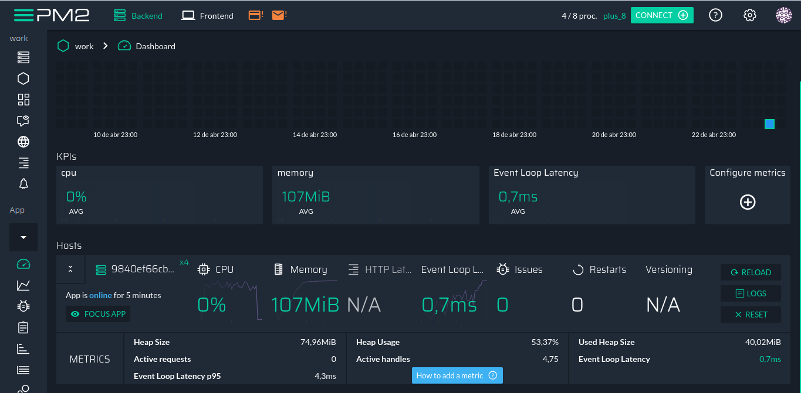

# Work Api

A "work" api provides endpoints for record of proposals and records for proposals, are included and finalized for a record of their records.

## Documentation

This project uses docker-compose to be able to facilitate the development, to run the project just have installed the doker and docker-compose.

With docker-compose and docker installed use the following commands to run the project:

```console
[user@machine:~]$ docker-compose up

# If superuser access is required use

[user@machine:~]$ sudo docker-compose up

```

The system displays logs of access and requests in the console and stores in files also, the log file is located in the directory /api/src/log/access.log, already for changes in the proposals the system stores the information referring to the operation directly in the MongoDb in collection log.


Pm2 is also used to initialize and manage the process, it is configured to start 4 instances




<a name="endpoints"></a>

### Endpoints

#### graphql
<dl>
<dt><a href="#graphql">Graphql - /v1/graphql</dt>
</dl>

#### final
<dl>
<dt><a href="#get_final">GET - /api/final</a></dt>
<dt><a href="#post_final">POST - /api/final</a></dt>
<dt><a href="#get_final_id">GET - /api/final/:id</a></dt>
<dt><a href="#put_final_id">PUT - /api/final/:id</a></dt>
<dt><a href="#delete_final_id">DELETE - /api/final/:id</a></dt>
</dl>

#### partial
<dl>
<dt><a href="#get_partial">GET - /api/partial</a></dt>
<dt><a href="#post_partial">GET - /api/partial</a></dt>
<dt><a href="#get_partial_id">GET - /api/partial/:id</a></dt>
<dt><a href="#put_partial_id">GET - /api/partial/:id</a></dt>
<dt><a href="#delete_partial_id">GET - /api/partial/:id</a></dt>
</dl>

#

<a name="graphql"></a>

> Graphql - /v1/graphql

Endpoint using graphql, follows the same rules of registers as the Rest calls, same required fields

Exemple of use:

```graphql
# get a proposal using id
query getProposal($id: String!){
  proposal(id: $id) {
    _id
    productId
    name
    email
    cpf
    birthdate
  }
}


# returns all bids that match the filters provided
query getAllProposals($name: String){
  proposals(name: $name) {
    total
    items{
      _id
      name
      cpf
      email
      phone
      productId
      birthdate
      createdAt
      updatedAt
    }
  }
}


# store a proposal, all parameters are required
mutation saveProposal{
  saveProposal(
    productId: 1
    name: "Jhon Doe"
    email: "jhondoe@email.com"
    cpf: "774.154.510-82"
    birthdate: "02/12/1988"
    phone: "+55 (18) 33272-9856"
  ) {
    _id
    productId
    name
    email
    cpf
    birthdate
    phone
    createdAt
    updatedAt
  }
}
```

this is the basic operation, more details on available parameters by accessing /v1/graphql

#

<a name="get_final"></a>

> GET - /api/final

used to list all proposals

additional parameters:

    - limit: type number
    - skip: type number

default values:

> ?limit=10&skip=0

result request example:

```json
{
    "total": 1,
    "items": [
        {
            "_id": "5cbdcab9baeb2b361ba444eb",
            "productId": 1,
            "name": "John Doe",
            "email": "johndoe@email.com",
            "cpf": "95049628075",
            "birthdate": "1985-06-17T03:00:00.000Z",
            "phone": "+55 (18) 3272-6365",
            "createdAt": "2019-04-22T14:07:53.671Z",
            "updatedAt": "2019-04-22T14:07:53.671Z",
        }
    ]
}

```

[<code>back to endpoints</code>](#endpoints)

#

<a name="post_final"></a>

> POST - /api/final

used to register a proposal

body resquest:

    all parameter is required
    - productId: type number
	- name: type string,
	- email: type string,
	- cpf: type string,
	- birthdate: type date or string,
	- phone: type string format "+99 (99) 9999-9999" or "+99 (99) 99999-9999"

result request example:

```json
{
    "_id": "5cbdcab9baeb2b361ba444eb",
    "productId": 1,
    "name": "John Doe",
    "email": "johndoe@email.com",
    "cpf": "95049628075",
    "birthdate": "1985-06-17T03:00:00.000Z",
    "phone": "+55 (18) 3272-6365",
    "createdAt": "2019-04-22T14:07:53.671Z",
    "updatedAt": "2019-04-22T14:07:53.671Z",
}

```

[<code>back to endpoints</code>](#endpoints)

#

<a name="get_final_id"></a>

> GET - /api/final/:id

used to obtain a record through the given id

result request example:

```json
{
    "_id": "5cbdcab9baeb2b361ba444eb",
    "productId": 1,
    "name": "John Doe",
    "email": "johndoe@email.com",
    "cpf": "95049628075",
    "birthdate": "1985-06-17T03:00:00.000Z",
    "phone": "+55 (18) 3272-6365",
    "createdAt": "2019-04-22T14:07:53.671Z",
    "updatedAt": "2019-04-22T14:07:53.671Z",
}

```

[<code>back to endpoints</code>](#endpoints)

#

<a name="put_final_id"></a>

> PUT - /api/final/:id

used to update a record of a proposal using the provided id

result request example:

```json
{
    "_id": "5cbdcab9baeb2b361ba444eb",
    "productId": 1,
    "name": "John Doe",
    "email": "johndoe@email.com",
    "cpf": "95049628075",
    "birthdate": "1985-06-17T03:00:00.000Z",
    "phone": "+55 (18) 3272-6365",
    "createdAt": "2019-04-22T14:07:53.671Z",
    "updatedAt": "2019-04-22T14:07:53.671Z",
}

```

[<code>back to endpoints</code>](#endpoints)

#

<a name="delete_final_id"></a>

> DELETE - /api/final/:id

used to exclude a record from a proposal using the provided id

result request No Content

StatusCode 204

[<code>back to endpoints</code>](#endpoints)

#

<a name="get_partial"></a>

> GET - /api/partial

used to list all partial of proposals

additional parameters:

    - limit: type = number
    - skip: type = number

default values:

> ?limit=10&skip=0

result request example:

```json
{
    "total": 1,
    "items": [
        {
            "_id": "5cbdcab9baeb2b361ba444eb",
            "productId": 1,
            "name": "John Doe",
            "email": "johndoe@email.com",
            "cpf": "95049628075",
            "birthdate": "1985-06-17T03:00:00.000Z",
            "phone": "+55 (18) 3272-6365",
            "createdAt": "2019-04-22T14:07:53.671Z",
            "updatedAt": "2019-04-22T14:07:53.671Z",
        }
    ]
}

```

[<code>back to endpoints</code>](#endpoints)

#

<a name="post_partial"></a>

> POST - /api/partial

used to register a partial, after the first request is returned a token that can be used in the next resquest to update that record, the endpoint post will redirect to the PUT and overwrite the data

body resquest:

    all parameters are not required, they will be provided in a partial way

    - productId: type number
	- name: type string,
	- email: type string,
	- cpf: type string,
	- birthdate: type date or string,
	- phone: type string

result request example:

```json
{
    "token": "5cbdcab9baeb2b361ba444eb",
    "cpf": "95049628075",
}

```

[<code>back to endpoints</code>](#endpoints)

#

<a name="get_partial_id"></a>

> GET - /api/partial/:id

used to obtain a record through the given id

result request example:

```json
{
    "_id": "5cbdcab9baeb2b361ba444eb",
    "cpf": "95049628075",
    "createdAt": "2019-04-22T14:07:53.671Z",
    "updatedAt": "2019-04-22T14:07:53.671Z",
}

```

[<code>back to endpoints</code>](#endpoints)

#

<a name="put_partial_id"></a>

> PUT - /api/partial/:id

used to update a record of a partial using the provided id

result request example:

```json
{
    "_id": "5cbdcab9baeb2b361ba444eb",
    "name": "John Doe",
    "cpf": "95049628075",
    "createdAt": "2019-04-22T14:07:53.671Z",
    "updatedAt": "2019-04-22T14:07:53.671Z",
}

```

[<code>back to endpoints</code>](#endpoints)

#

<a name="delete_partial_id"></a>

> DELETE - /api/partial/:id

used to exclude a record from a partial using the provided id

result request No Content

StatusCode 204

[<code>back to endpoints</code>](#endpoints)

#

The api code documentation is in the ./docs directory in html format and [here in Markdown](https://github.com/sandroramone/work/blob/master/DOCUMENTATION.md).
